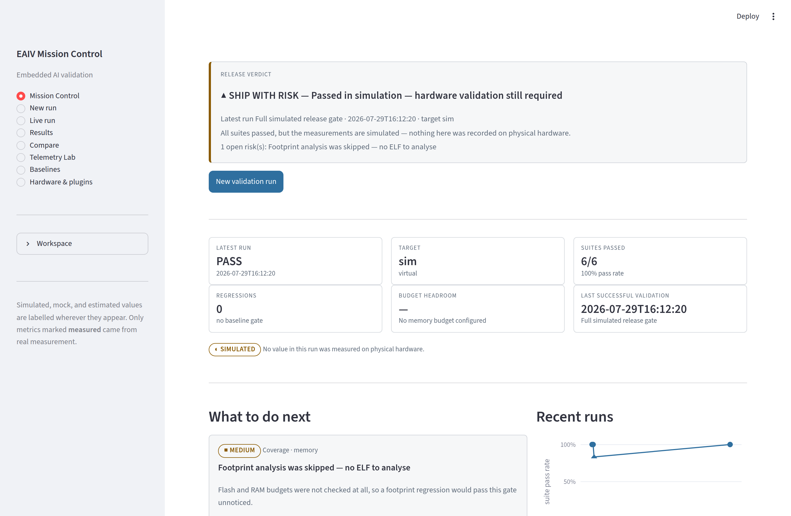
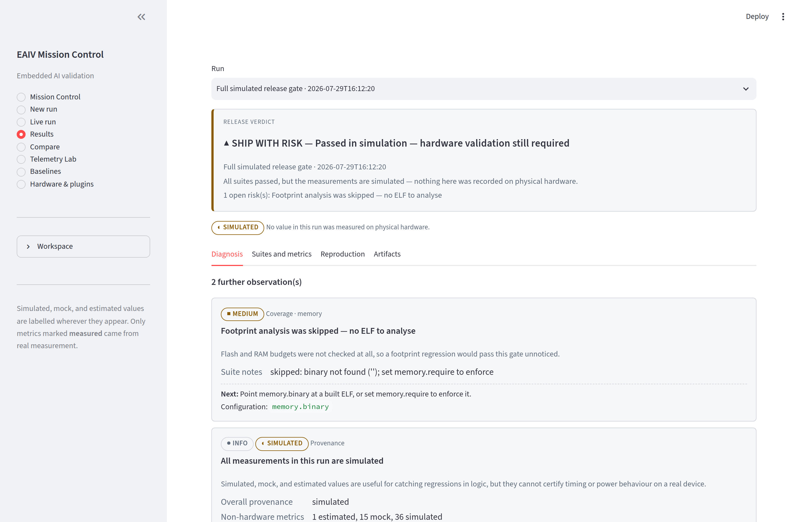
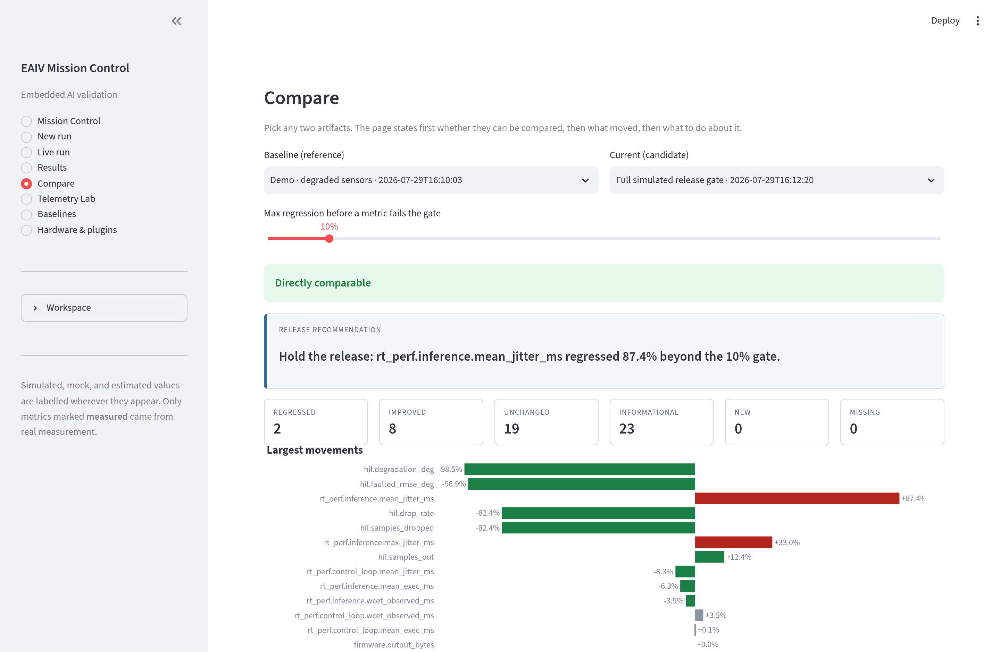

# EAIV Mission Control

The dashboard is a validation instrument, not an analytics page: it exists
to move an engineer through one workflow — **discover hardware → configure
a mission → run it → watch it → understand the failure → compare against a
baseline → decide whether to ship.**

```bash
pip install -e ".[dashboard]"
eaiv dashboard                          # recommended
eaiv dashboard --port 8600 --headless
streamlit run dashboard/python/app.py   # still works
```

`eaiv dashboard` passes the report, baseline, and mission directories
through the environment and sets the instrument accent colour, so the app
looks and behaves the same from any working directory.

No data yet? `eaiv demo` produces three complete simulated runs — or press
**Run simulated demo** on the landing page.



*Mission Control: the verdict first, then the numbers, then what to do
next. The provenance chip says plainly that nothing here was measured on
hardware.*

## Pages

### Mission Control

The landing page answers six questions before you click anything:

- **Is the current release safe to ship?** — one verdict banner: READY,
  AT RISK, BLOCKED, or NO DATA, with the reasons underneath.
- **What changed since the baseline?** — regression count and the worst
  one, named.
- **Which target was tested?** — board identity and architecture.
- **What is the highest-priority problem?** — the top findings, as cards
  with evidence and a next action.
- **What should I do next?** — every finding carries one.
- **When was the last successful validation?** — a timestamp, or "never".

Plus a recent-run timeline, one prominent **New validation run** action,
and — when no runs exist — a one-click simulated demo. There is no dead
empty state telling you to go back to the terminal.

### New run

A seven-step mission builder:

1. **Target** — every registered `target` plugin, including any a third
   party installed. Selecting one shows only the fields that apply to it.
2. **Firmware, model, and datasets** — inputs, with missing files flagged.
3. **Validation suites** — with a one-line explanation of each.
4. **Limits and fault scenarios** — the thresholds that turn a measurement
   into a pass or a fail, plus fault-chain and task-set editors driven by
   the registry.
5. **Baseline and regression policy** — which baseline to gate against,
   the allowance, and whether to promote on success.
6. **Review** — field-level validation findings and the resolved YAML.
7. **Launch** — with the exact equivalent `eaiv pipeline` command shown
   first, so you can paste it into CI.

**Save mission** writes an ordinary eaiv config (plus a `mission:` block
recording the intent) into `missions/`. `eaiv pipeline --config` accepts it
directly.

Nothing here is hard-coded: target kinds, fusion algorithms, fault models,
power monitors, and telemetry adapters all come from the plugin registry,
and every field's label, default, description, and validation come from the
[configuration schema](../src/eaiv/configspec/schema.py).

### Live run

Stage timeline with the active stage, elapsed time, streaming log, suite
progress, metrics as they arrive, connected-target information, generated
artifacts, and a cancel control.

All of it is read from the run directory rather than session memory, so a
browser refresh, a second tab, or a restarted server show the same run in
the same state. A run whose process died appears as **interrupted**, not as
a spinner that never stops. Cancellation is written to disk, so it works
even for a run another session started.

### Results and diagnosis

Leads with the diagnosis, not the numbers. For every failure and
regression:

- what failed, and the observed value;
- the threshold or baseline it was measured against;
- the magnitude of the miss;
- why the metric matters;
- the evidence behind the claim;
- the recommended next action, with the command or the config path.

Interpretations that are not direct measurements are labelled **INFERRED**.
Tabs alongside cover suites and metrics (with the latency distribution),
reproduction context (versions, git, host, input hashes, thresholds, the
resolved config), and downloadable artifacts.



*Each finding names the observed value, what it was measured against, the
size of the miss, why it matters, and the command that investigates it.*

### Compare

A release-decision workspace over any two artifacts — recorded runs,
legacy report files, or stored baselines.

It leads with **whether the pair can be compared at all**: different
targets, mismatched provenance, changed model/dataset/firmware hashes,
differing suite coverage, and platform-version differences are each named
and explained. Then: metrics grouped by suite, sortable by largest
regression or improvement, absolute and percentage changes,
direction-aware verdicts, newly added and missing metrics, a release
recommendation, and Markdown/JSON export.



*Compatibility first, then the movements. Regressions and improvements are
distinguished by direction, not by whether the number went up.*

### Telemetry Lab

Leads with whether the capture is trustworthy: sample-rate consistency
against the declared rate, gaps with a missing-sample estimate, and
non-monotonic timestamps. Then grouped multi-signal plots with range
selection, per-channel statistics, median-based outlier detection with
sample inspection, estimated-versus-ground-truth orientation with RMSE,
bias and drift, and a download of the filtered data.

Files come from disk (restricted to the session's allowed directories) or
from an upload with a size limit. Neither path lets the browser address
arbitrary files on the host.

### Baselines

List baselines with their metadata and which saved missions gate against
each one. Promote a passing run (failing runs are not offered — promotion
of a failing run is refused by design), inspect a baseline's suites,
compare a candidate against it, and archive or delete one behind a
type-the-name confirmation that warns about dependent missions.

### Hardware and plugins

Everything this installation can drive: plugin type, name, version,
description, source package, availability, and any missing optional
dependency with the command that installs it. An on-demand target probe
reports whether hardware is reachable (probing opens a transport, so it
never runs as a side effect of rendering), plus the full `eaiv doctor`
diagnosis.

## Design notes

- **Provenance is always visible.** Simulated, mock, and estimated values
  are labelled everywhere they appear. Only metrics marked *measured* came
  from real measurement.
- **Status never depends on colour alone.** Every status carries a glyph
  and a word as well as a hue, so the display works in greyscale and in
  high-contrast mode.
- **Red means failure, not "primary".** Streamlit's default accent is
  recoloured to an instrument blue so red is reserved for real problems.
- **No business logic in the pages.** Loading, diagnosis, comparison, and
  validation live in `eaiv.core`, `eaiv.insights`, `eaiv.configspec`, and
  `eaiv.dashboard` — all Streamlit-free and unit-tested. Each view module
  exposes a single `render(workspace)`.
- **Caching is invalidated by file mtime**, so a rewritten report is
  picked up without a manual refresh; large telemetry CSVs are read as a
  bounded preview and downsampled for display.

## Layout

```text
src/eaiv/dashboard/          data layer — no Streamlit import
├── data.py                  report loading and metric shaping
├── runs.py                  runs + legacy reports as uniform sources
├── signals.py               telemetry timing/statistics analysis
├── safety.py                path and upload guards
└── ui/                      presentation layer
    ├── app.py               entry point and navigation
    ├── theme.py             stylesheet, status tones, chips
    ├── components.py        reusable widgets
    ├── state.py             workspace, caching (keyed on file mtime)
    ├── runner.py            background run execution
    └── views/               one module per page
dashboard/python/app.py      compatibility shim for the documented command
```

## Reading the data layer from your own front end

The data layer is deliberately UI-agnostic:

```python
from eaiv.dashboard.runs import all_sources
from eaiv.insights import decide, generate_insights
from eaiv.runs import RunStore

store = RunStore("reports")
store.reconcile_all()
for source in all_sources(store, "reports"):
    report = source.report()
    insights = generate_insights(report, manifest=source.manifest)
    print(source.label, decide(report, insights).verdict, len(insights))
```

See also: [runs and reports](../docs/runs-and-reports.md),
[configuration reference](../docs/config-reference.md).
